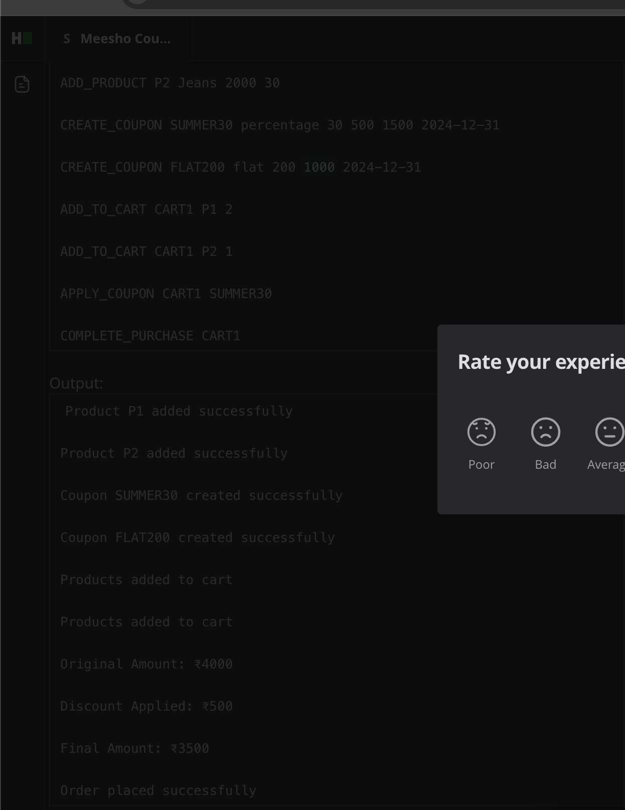

# Coupon Management System – Low-Level Design

## 1. Goal

Design and implement a **Coupon Management System** that supports adding products to a catalog, creating and applying coupons with various constraints, maintaining carts for users, and processing purchases (including payment). The system must handle product stock updates upon purchase completion and optionally keep track of user purchase history.

---

## 2. Detailed Requirements

### 2.1 Product Catalog
- Each product has:
    - **Product ID** (e.g., `"P1"`)
    - **Name** (e.g., `"Jeans"`)
    - **Price** (e.g., `2000`)
    - **Stock Quantity** (e.g., `30`)
- The system allows adding a new product with a command:
  ADD_PRODUCT <productId> <name> <price> <stock>

- The system must store and be able to retrieve **all available products** for browsing.

### 2.2 Cart Management
- Multiple users or multiple carts can exist in the system.
- To add items to a cart:
  ADD_TO_CART <cartId> <productId> <quantity>
- If `<cartId>` does **not** exist, create a new cart with that ID.
- If `<cartId>` exists, add items to the existing cart.
- The system should be able to show or calculate the cart total (sum of each item’s `price * quantity`).

### 2.3 Coupon Creation & Usage
- The system allows creating coupons with the following details:
- **Coupon Code** (e.g., `"SUMMER30"`)
- **Discount Type** (e.g., `percentage` or `flat`)
- **Discount Value** (e.g., `30` for 30%, or `200` for a flat 200 off)
- **Maximum Discount** (upper limit on the discount amount or cap on percentage discount)
- **Usage Limit** (how many times this coupon can be used before it is invalid)
- **Expiry Date**
- Example command to create a coupon:
  CREATE_COUPON <couponCode> <discountType> <discountValue> <maxDiscount> <usageLimit> <expiryDate>
- 
- A coupon can be applied to a cart with:
  APPLY_COUPON <cartId> <couponCode>

- **Validations**:
1. The coupon must not be **expired** (check expiry date).
2. The coupon must not have exceeded its **usage limit**.
3. The discount must respect the **maximum discount** (if it’s a percentage-based coupon, ensure the discount is capped).

### 2.4 Completing a Purchase
- Command example:
  COMPLETE_PURCHASE <cartId>

- Steps upon purchase completion:
1. **Validate** the cart total and applied coupon (if any).
2. **Process Payment** (for the exercise, either a mock success/failure flow or a payment strategy pattern).
3. **Reduce Stock** of each product in the cart according to the purchased quantity.
4. If successful, **record** the order in a purchase history (if needed).
5. **Increment** the coupon usage count (if used).

### 2.5 Output and Logging
- The system should print relevant logs or messages for each operation, for example:
- **Adding a product**:
  ```
  Product <productId> added successfully
  ```
- **Creating a coupon**:
  ```
  Coupon <couponCode> created successfully
  ```
- **Adding to cart**:
  ```
  Products added to cart
  ```
- **Applying a coupon**:
  ```
  Coupon <couponCode> applied successfully
  ```
  or an error message if invalid.
- **Purchase completion** should display:
    - **Original Amount** (before discount)
    - **Discount Applied**
    - **Final Amount** (after discount)
    - A success or failure message.

### 2.6 Bonus / Additional Requirements
- **User Purchase History**: Track and retrieve all past orders for a user or cart.
- **Concurrent Usage**: Multiple users might apply the same coupon simultaneously. The system must handle potential race conditions (e.g., usage limit going beyond the allowed count).
- **Robust Error Handling** for invalid products, out-of-stock scenarios, coupon expired or usage limit exceeded, payment failure, etc.

---

## 3. Example Input/Output Flow (Illustrative)

**Commands**:
ADD_PRODUCT P1 Shirt 1000 20 
ADD_PRODUCT P2 Jeans 2000 30 
CREATE_COUPON SUMMER30 percentage 30 500 1500 2024-12-31 
CREATE_COUPON FLAT200 flat 200 1000 2024-12-31 
ADD_TO_CART CART1 P1 2 
ADD_TO_CART CART1 P2 1 APPLY_COUPON CART1 SUMMER30 
COMPLETE_PURCHASE CART1

**Sample Output**:
Product P1 added successfully Product P2 added successfully Coupon SUMMER30 created successfully Coupon FLAT200 created successfully Products added to cart Products added to cart Original Amount: 4000 Discount Applied: 500 Final Amount: 3500 Purchase completed successfully!

*(The numerical values here are just for demonstration; exact amounts depend on the logic and prices.)*

---

## 4. What You Need To Deliver

1. A **Low-Level Design** demonstrating:
    - **SOLID principles**
    - Appropriate **design patterns** (e.g., Strategy for payment, optional separate discount strategy, etc.)
2. A **Working Code Implementation** in Java (or a specified language) that:
    - Defines the necessary classes, interfaces, methods, and custom exceptions.
    - Can run from a single `main()` method (or driver) showing:
        1. Adding products and coupons
        2. Adding items to a cart
        3. Applying coupons
        4. Completing purchase (including discount calculation and final amount).
    - Prints the **output messages** at each step (e.g., product added, coupon created, discount applied, etc.).
3. **Proper Exception Handling** for out-of-stock errors, invalid coupon usage, expired coupons, payment failures, etc.
4. **Extendability**:
    - It should be straightforward to add new discount types (e.g., BOGO, tiered discounts) or new payment methods (e.g., Net Banking).
---

### End of Document


-- Solution steps

Entities : 

User, 
CartItem -> 
Product [stock, ]
Cart
Coupon


Repositories: 
CouponRepository
ProductRepository


Service classes: 
CouponManager
CouponValidator
ProductInventoryManager{CatalogService} [can use the product repository to do all the CRUD]


Exceptions



